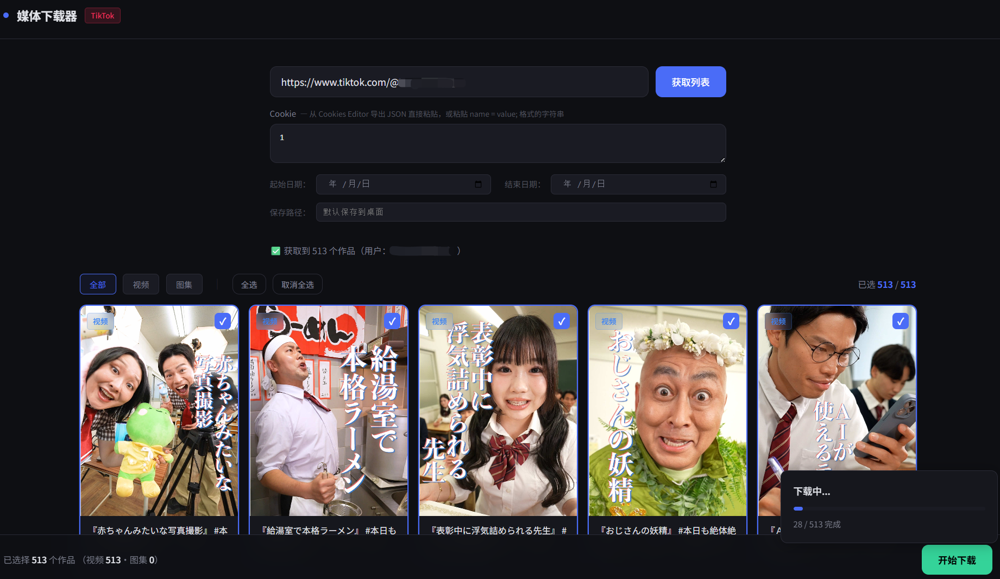
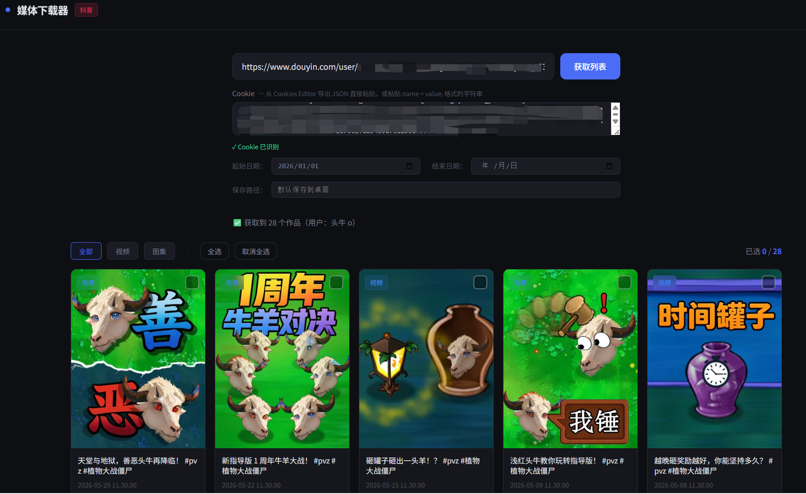

> **English** | [简体中文](README.zh-CN.md) | [日本語](README.ja.md)

# Media Downloader

A multi-platform profile downloader with a local web interface. Supports **TikTok, Instagram, and Douyin**.

Preview a creator's posts, filter by date range, hand-pick what you want, and let the tool download everything in the background. Videos and image carousels are automatically sorted into separate folders.

The Douyin core is based on [jiji262/douyin-downloader](https://github.com/jiji262/douyin-downloader) (MIT). On top of that, this project adds a web UI, date filtering, and support for TikTok and Instagram.





## Features

- Paste a profile URL and pull the full list of posts from that account
- Web UI displays thumbnails, captions, post dates, and type tags (video / image set)
- Filter posts by date range
- Manually check off the ones you actually want
- Downloads are auto-sorted into `video/` and `image/` subfolders
- Silent background downloading with live progress in the browser
- Platform (TikTok / Instagram / Douyin) is auto-detected from the URL

## Platform Support at a Glance

| Platform  | How the list is fetched | Cookie required         | Extra requirements                              |
| --------- | ----------------------- | ----------------------- | ----------------------------------------------- |
| TikTok    | Real browser session    | No (uses browser login) | Launch Chrome in debug mode and log into TikTok |
| Instagram | Web API                 | Yes (paste in the UI)   | None                                            |
| Douyin    | Web API                 | Yes (paste in the UI)   | None                                            |

> TikTok's anti-bot protection is significantly stronger than Douyin's, and plain HTTP requests get blocked. This project did try a pure-Python reimplementation of TikTok's web signatures (X-Bogus / X-Gnarly), but TikTok's `item_list` endpoint also requires an `msToken` that's generated inside a real browser session — something a standalone script can't reliably produce. That approach was abandoned in favor of driving an actual browser.

> For TikTok, this tool drives **your local Chrome** so the browser supplies a legitimate, signed-in session and the signature/anti-bot problem goes away. That's why TikTok's setup is different from the other two platforms.

## Installation

Requires Python 3.8+

```bash
pip install -r requirements.txt
```

TikTok additionally needs Playwright (to drive the browser):

```bash
pip install playwright
```

> This project uses your **already-installed Chrome**, so you do **not** need to run `playwright install chromium`.

## Usage

### TikTok

TikTok requires launching Chrome in debug mode first so the tool can attach to a real, logged-in browser session.

1. **Close all Chrome windows**, then launch Chrome with debug flags:

   **Windows:**

   ```bash
   "C:\Program Files\Google\Chrome\Application\chrome.exe" --remote-debugging-port=9222 --user-data-dir="C:\chrome-debug"
   ```

   **macOS:**

   ```bash
   /Applications/Google\ Chrome.app/Contents/MacOS/Google\ Chrome --remote-debugging-port=9222 --user-data-dir="$HOME/chrome-debug"
   ```

   **Linux:**

   ```bash
   google-chrome --remote-debugging-port=9222 --user-data-dir="$HOME/chrome-debug"
   ```

2. In this freshly launched Chrome, **log into TikTok** and make sure you can browse the target profile normally.
   Keep this window **open** for the entire download session. Don't use it to browse other sites while downloading.

3. In a separate terminal, start the server:

   ```bash
   python web_app.py
   ```

4. Open `http://localhost:5001` in your browser and paste the TikTok profile URL
   (`https://www.tiktok.com/@username`). Optionally set a date range, then click **Fetch List**.
   The tool will drive your debug-mode Chrome to open the profile and scroll down to collect posts.

5. Check the posts you want and click **Start Download**.

> On slow connections, scrolling all the way to the bottom and confirming "no more posts" can take 10+ seconds. That's normal.

### Instagram

1. Log into Instagram in your browser, then export the cookie using an extension like [Cookies Editor](https://chromewebstore.google.com/detail/cookies-editor/iphcomljdfghbkdcfndaijbokpgddeno).
2. Start the server:

   ```bash
   python web_app.py
   ```

   Open `http://localhost:5001`.

3. Paste the exported cookie into the Cookie field on the page.
4. Paste a profile URL: `https://www.instagram.com/username/`
5. (Optional) Set a start / end date.
6. Click **Fetch List**, check the posts you want, and click **Start Download**.

### Douyin

Same workflow as Instagram.

1. Log into Douyin's web version and export the cookie via [Cookies Editor](https://chromewebstore.google.com/detail/cookies-editor/iphcomljdfghbkdcfndaijbokpgddeno) (or similar).
2. Start the server:

   ```bash
   python web_app.py
   ```

3. Open `http://localhost:5001`, paste the cookie, then paste a profile URL:
   - `https://v.douyin.com/xxx/` or
   - `https://www.douyin.com/user/xxx`
4. (Optional) Set a date range.
5. Click **Fetch List**, check the posts, and click **Start Download**.

## File Structure

```
save_path/
  username/
    video/
      2026-01-01_caption.mp4
    image/
      2026-01-02_carousel_caption/
        1.jpg
        2.jpg
```

## Notes & Disclaimer

- This project is for **personal study and backup** only. Do not use it for commercial purposes, mass scraping, or anything that infringes on others' rights.
- Respect content creators' rights and the terms of service of each platform.
- You are solely responsible for how you use this tool and for any consequences that result.
- Cookies and session tokens expire. When they do, export them again or log back in.
- Keep your request rate reasonable to avoid putting load on the platforms.

## License

Released under the [MIT](https://opensource.org/licenses/MIT) license.

The Douyin downloading core is based on [jiji262/douyin-downloader](https://github.com/jiji262/douyin-downloader) (MIT). The original license and copyright notice are preserved — thanks to the original authors.
